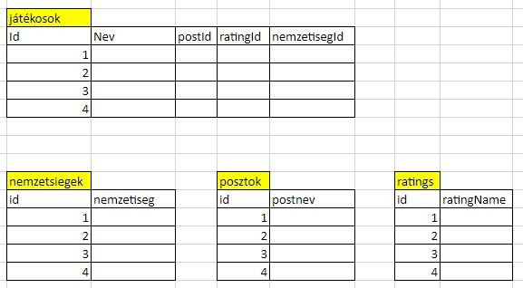
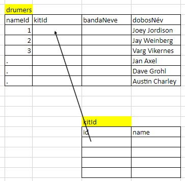
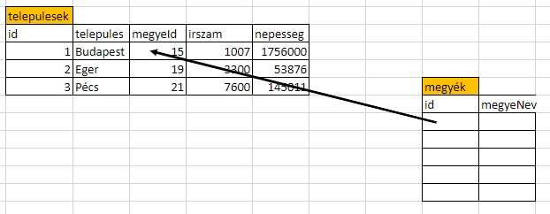
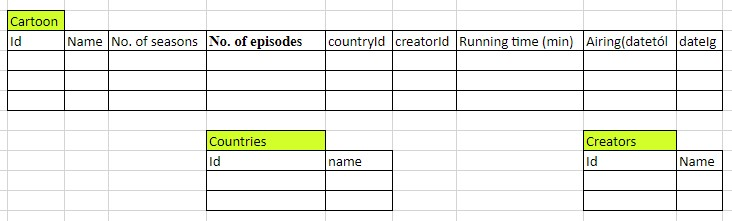
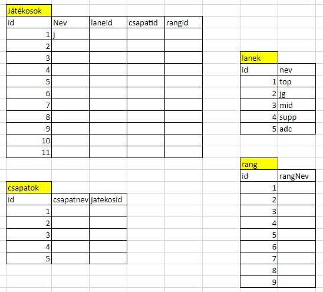
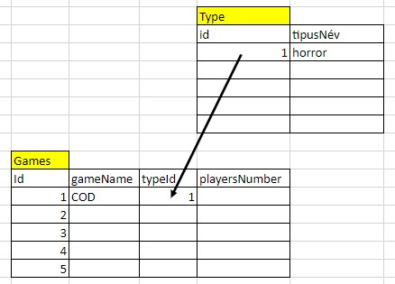

# Feladat kitűzés

## Általános megfogalmazás
Készítsen egyszerű (néhány táblás, egy-több kapcsolatú) adatbázist, amin kliens oldalon el tud végezni minden CRUD műveltet:
- Listázás, keresés
- Törlés
- Bővítés
- Módosítás

## Környezet
- Adatbázis: 
    - Mysql szerver
    - Adatbázis tervezés: grafikus diagram
    - Lekérdezés dokumentáció: `projektnev.sql`
    - Biztonsági másolat
    - Az adatbázis szerkezete angol nyelvű
- Backend: Nodejs alapú Mysql szerver
- Frontend: 
    - natúr js-ben megírt (kód szerkezeti elemeinek nyelve: angol)
    - Bootsrap alapú dizájn, 
    - ajax kérésekkel kommunikáló
    - Kártyás vagy táblázat alakú listázás
    - Kereső funkció
    - Törlés
    - Adat módosítás
    - Új adat bevitel
- Github fejlesztési és publikációs környezet
- Mappa szerkezet
    - `server`: ide kerül a backend kód
        - A backendet az általunk kifejlesztett kódba kell implementálni
    - `frontend`: ide kerül a frontend kód
    - `database_doc`: ide kerül minden adatbázis dokumentáció
        - adatbázis diagram
        - biztonsági mentés
        - sql lekérdezés dokumentáció: `projektnev.sql`

# Konkrét feladatok
## Fehér György Márk: `focicsapat`

## Fehér Zsolt Dorián: `fifa`

## Hajdu István: `dobosok`

## Jáger Kristóf: `telepulesek`

## Juhász Gergő: 

## Kovács János: `rajzfilmek`

## Ledacs-Kiss Bence

## Medgyes Csaba: `hazak`

## Molnár Krisztián: `legendakLigaja`

## Nagy Ferenc: `jatekok`

## Oláh Péter: `genshimImpact`

## Polyák Alex János: `verseny`

